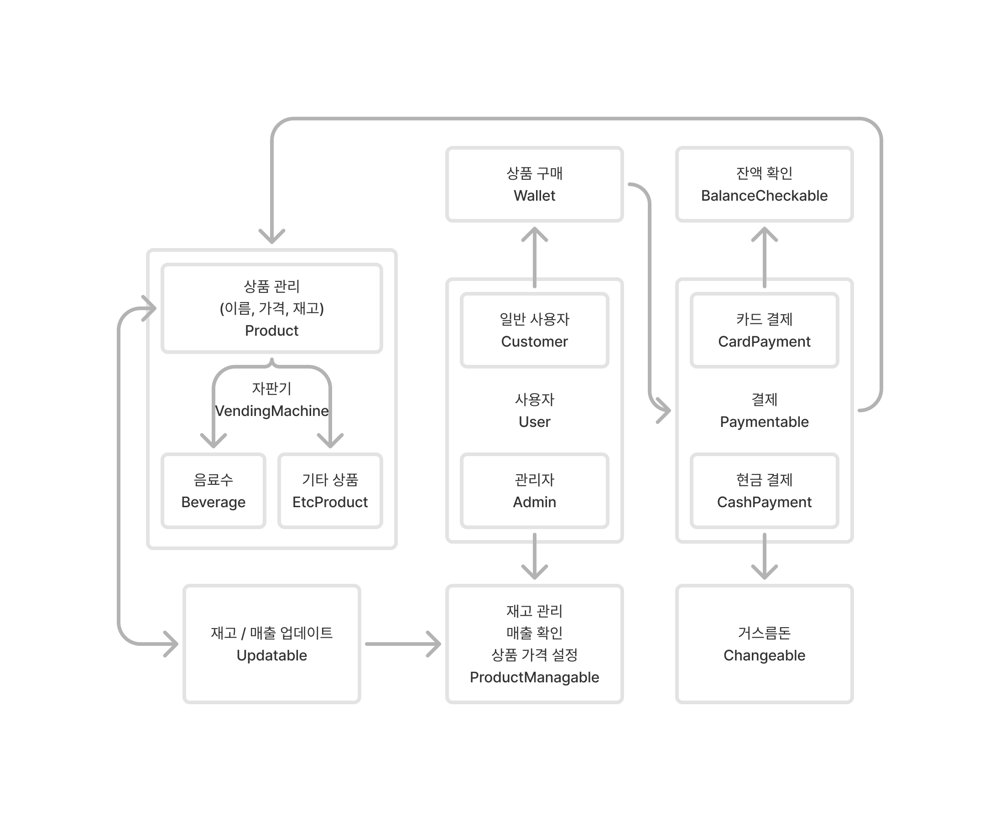

# 자판기 만들기
* Java 숙련도 향상을 위해 진행한 자판기 생성 프로젝트입니다.

 

## 기능
1. 고객의 상품 구매
   * 고객은 자판기의 상품을 구매할 수 있습니다.
   * 결제는 현금 결제와 카드 결제가 가능합니다.
   * 현금 결제의 경우 거스름돈이 계산되고, 카드 결제의 경우 잔액을 확인할 수 있습니다.
2. 관리자의 상품 관리
   * 관리자는 재고 확인, 매출 확인, 상품 가격 설정을 할 수 있습니다.
   * 상품은 음료수와 기타 상품으로 구분해 관리됩니다.
   * 각 상품은 이름, 가격, 재고 수량을 가집니다.

 

## Wireframe
